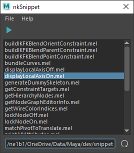

# nkSnippet

[](https://github.com/imaoki/nkSnippet/releases/latest)

簡易MELランチャー。

## 特徴



* 任意のディレクトリ内のMELファイルをリスト化しダブルクリックで実行可能。

## 開発環境

Maya 2022.5 / Windows 10

## インストール

01. `nkSnippet.mel`をスクリプトディレクトリにコピー

    | バージョン | ディレクトリ                             |
    | ---------- | ---------------------------------------- |
    | 英語版     | `%MAYA_APP_DIR%\<version>\scripts`       |
    | 日本語版   | `%MAYA_APP_DIR%\<version>\ja_JP\scripts` |

02. Mayaを再起動

## 起動方法

```mel
nkSnippet;
```
